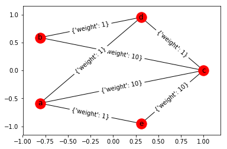

### python - networkx
- 분석을 하는데 네트워크 분석을 해야해서, 파이썬 네트워크 분석 라이브러리인 networkx를 사용함
- 예전에도 깔짝깔짝 쓰긴 했었는데, 이참에 좀 제대로 정리를 해두는 게 좋을것 같아서 정리해봄


```python
%matplotlib inline
import networkx as nx
import matplotlib.pyplot as plt
```

#### Graph
- 총 네 가지의 graph가 있음
    1. `Graph`: undirected graph, not allowed multiple edges
    2. `DiGraph`: directed graph not allowed multiple edges
    3. `MultiGraph`: undirected graph, allowed multiple edges
    4. `MultiDiGraph`: directed graph, allowed multiple edges


```python
G = nx.Graph()
DG = nx.DiGraph()
MG = nx.MultiGraph()
MDG = nx.MultiDiGraph()
```

#### Graph edge creation 
- node, edge를 각각 추가할 수 있지만, 보통 edge를 추가하면 node는 자동으로 추가되므로 나는 edge만 추가함


```python
weighted_edge_lst = [('a', 'b', 5), ('b', 'c',20), ('d', 'c', 20), ('a', 'e', 3), ('a', 'f', 7)]
print(weighted_edge_lst)
```

    [('a', 'b', 5), ('b', 'c', 20), ('d', 'c', 20), ('a', 'e', 3), ('a', 'f', 7)]
    

- `add_weighted_edges_from`: (from_node, to_node, weight)


```python
G = nx.Graph()
G.add_weighted_edges_from(weighted_edge_lst)
print(G.nodes())
print(G.edges(data=True))
```

    ['e', 'd', 'b', 'f', 'c', 'a']
    [('e', 'a', {'weight': 3}), ('d', 'c', {'weight': 20}), ('b', 'c', {'weight': 20}), ('b', 'a', {'weight': 5}), ('f', 'a', {'weight': 7})]
    

- `add_edges_from`: (from_node, to_node)
    - edge는 `(source, target, data_dict)`로 구성된다고 생각하면 됨


```python
G = nx.Graph()
G.add_edges_from([(edge[0], edge[1]) for edge in weighted_edge_lst])
print(G.edges()) 
print(G.edges(data=True)) 
```

    [('e', 'a'), ('d', 'c'), ('b', 'c'), ('b', 'a'), ('f', 'a')]
    [('e', 'a', {}), ('d', 'c', {}), ('b', 'c', {}), ('b', 'a', {}), ('f', 'a', {})]
    

### centrality analysis
- 우리 연구실에서는 node들의 centrality를 분석하는 프로젝트를 과거에 많이 수행함
    - 특정 도메인의 논문들을 대상으로 키워드들을 분석하여 중요한 키워드를 도출하는 분석
    - 키워드가 아닌, author, affiliation등을 노드로 정의하고 분석하는 것도 가능
- 따라서, networkx에서 centrality analysis를 분석하는 것을 집중적으로 봄

#### degree centrality
- 개별 노드들에 직접적으로 연결된 edge의 수를 중심으로 계산하는 centrality
    - in-degree, out-degree 로도 계산할 수 있지만, 내가 분석하려는 문제에서는 edge에 방향성이 없다고 가정하기 때문에, degree만 고려함


```python
G = nx.Graph()
G.add_weighted_edges_from(weighted_edge_lst)
print(G.edges(data=True))
print(G.degree())
print(nx.degree_centrality(G)) 
```

    [('e', 'a', {'weight': 3}), ('d', 'c', {'weight': 20}), ('b', 'c', {'weight': 20}), ('b', 'a', {'weight': 5}), ('f', 'a', {'weight': 7})]
    {'e': 1, 'd': 1, 'b': 2, 'f': 1, 'c': 2, 'a': 3}
    {'e': 0.2, 'd': 0.2, 'b': 0.4, 'f': 0.2, 'c': 0.4, 'a': 0.6000000000000001}
    

- 하지만 `nx.degree_centrality`에서는 weight가 고려되어 있지 않음, 
- weight를 고려하기 위해서는 use `MultiGraph()`
    - but not normalization, post-processing needed


```python
MG = nx.MultiGraph()
MG.add_edges_from( [ (edge[0], edge[1]) for edge in weighted_edge_lst for i in range(0, edge[2])] )
print(MG.edges())
print("MG.degree():", MG.degree())
print("nx.degree_centrality(MG):", nx.degree_centrality(MG))
deg_cen = nx.degree_centrality(MG)
print("normalized:", {k:deg_cen[k]/max(deg_cen.values()) for k in deg_cen.keys()})
```

    [('e', 'a'), ('e', 'a'), ('e', 'a'), ('d', 'c'), ('d', 'c'), ('d', 'c'), ('d', 'c'), ('d', 'c'), ('d', 'c'), ('d', 'c'), ('d', 'c'), ('d', 'c'), ('d', 'c'), ('d', 'c'), ('d', 'c'), ('d', 'c'), ('d', 'c'), ('d', 'c'), ('d', 'c'), ('d', 'c'), ('d', 'c'), ('d', 'c'), ('d', 'c'), ('b', 'c'), ('b', 'c'), ('b', 'c'), ('b', 'c'), ('b', 'c'), ('b', 'c'), ('b', 'c'), ('b', 'c'), ('b', 'c'), ('b', 'c'), ('b', 'c'), ('b', 'c'), ('b', 'c'), ('b', 'c'), ('b', 'c'), ('b', 'c'), ('b', 'c'), ('b', 'c'), ('b', 'c'), ('b', 'c'), ('b', 'a'), ('b', 'a'), ('b', 'a'), ('b', 'a'), ('b', 'a'), ('f', 'a'), ('f', 'a'), ('f', 'a'), ('f', 'a'), ('f', 'a'), ('f', 'a'), ('f', 'a')]
    MG.degree(): {'e': 3, 'd': 20, 'b': 25, 'f': 7, 'c': 40, 'a': 15}
    nx.degree_centrality(MG): {'e': 0.6000000000000001, 'd': 4.0, 'b': 5.0, 'f': 1.4000000000000001, 'c': 8.0, 'a': 3.0}
    normalized: {'e': 0.07500000000000001, 'd': 0.5, 'b': 0.625, 'f': 0.17500000000000002, 'c': 1.0, 'a': 0.375}
    

#### closeness centrality
- 해당 노드가 다른 노드들과 얼마나 가깝게 있는가를 측정하는 분석
    - closeness centrality의 경우는 edge의 data_dict에서 해당 값의 key를 distance로 넘기면 됨


```python
G = nx.Graph()
G.add_weighted_edges_from( [(edge[0], edge[1], 1.0/edge[2]) for edge in weighted_edge_lst])
print(G.edges(data=True))
print("nx.closeness_centrality(G):", nx.closeness_centrality(G))
print("nx.closeness_centrality(G, distance='weight'):",nx.closeness_centrality(G, distance="weight"))
```

    [('e', 'a', {'weight': 0.3333333333333333}), ('d', 'c', {'weight': 0.05}), ('b', 'c', {'weight': 0.05}), ('b', 'a', {'weight': 0.2}), ('f', 'a', {'weight': 0.14285714285714285})]
    nx.closeness_centrality(G): {'e': 0.4166666666666667, 'd': 0.35714285714285715, 'b': 0.625, 'f': 0.4166666666666667, 'c': 0.5, 'a': 0.625}
    nx.closeness_centrality(G, distance='weight'): {'e': 1.9534883720930232, 'd': 3.2761310452418093, 'b': 4.077669902912622, 'f': 2.7814569536423845, 'c': 3.770197486535009, 'a': 4.077669902912621}
    

#### betweenness centrality
- 해당 노드가 서로 다른 두 노드간의 최단 거리를 얼마나 많이 지나가느냐 를 측정
    - 그런데, weight를 넣든 안 넣든 값이 똑같이 나와서, 예시 그래프의 문제인지, 함수의 문제인지 확인해봄


```python
print(G.edges(data=True))
print(nx.betweenness_centrality(G))
print(nx.betweenness_centrality(G, weight="weight")) 
```

    [('e', 'a', {'weight': 3}), ('d', 'c', {'weight': 20}), ('b', 'c', {'weight': 20}), ('b', 'a', {'weight': 5}), ('f', 'a', {'weight': 7})]
    {'e': 0.0, 'd': 0.0, 'b': 0.6000000000000001, 'f': 0.0, 'c': 0.4, 'a': 0.7000000000000001}
    {'e': 0.0, 'd': 0.0, 'b': 0.6000000000000001, 'f': 0.0, 'c': 0.4, 'a': 0.7000000000000001}
    


```python
def draw_graph(input_G):
    plt.figure()
    layout= nx.circular_layout(input_G)
    print("layout:", layout)
    nx.draw_networkx(input_G, pos=layout)
    nx.draw_networkx_edge_labels(input_G, pos=layout)
G1 = nx.Graph()
G1.add_weighted_edges_from([('b', 'c', 10), ('a', 'c', 10), ('c', 'd', 1), ('c', 'e', 10)])
G1.add_weighted_edges_from([('a', 'e', 1), ('a', 'd', 1), ('d', 'b', 1)])

draw_graph(G1)
```

    layout: {'c': array([ 1.,  0.]), 'd': array([ 0.30901699,  0.95105652]), 'b': array([-0.80901699,  0.58778525]), 'a': array([-0.80901699, -0.58778525]), 'e': array([ 0.30901699, -0.95105652])}
    





- weight를 고려했을 때, b와 c 간의 최단경로는 bdc, 고려하지 않으면, bc


```python
print(G1.edges(data=True))
print(nx.shortest_path(G1, 'b', 'c'))
print(nx.shortest_path(G1, 'b', 'c', weight='weight'))
```

    [('c', 'e', {'weight': 10}), ('c', 'd', {'weight': 1}), ('c', 'b', {'weight': 10}), ('c', 'a', {'weight': 10}), ('d', 'b', {'weight': 1}), ('d', 'a', {'weight': 1}), ('a', 'e', {'weight': 1})]
    ['b', 'c']
    ['b', 'd', 'c']
    

- 그래프의 문제였음. 아래는 다르게 잘 나옴. 


```python
print(nx.betweenness_centrality(G1))
print(nx.betweenness_centrality(G1, weight="weight")) 
```

    {'c': 0.3333333333333333, 'd': 0.08333333333333333, 'b': 0.0, 'a': 0.08333333333333333, 'e': 0.0}
    {'c': 0.0, 'd': 0.8333333333333333, 'b': 0.0, 'a': 0.5, 'e': 0.0}
    

- 이후, clustering, clique 분석 등의 작업을 수행하는 것이 필요함

- http://networkx.readthedocs.io/en/networkx-1.11/


```python

```
